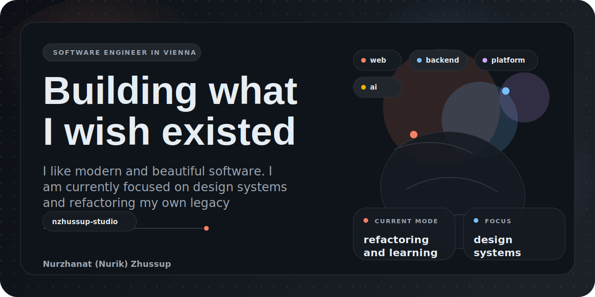

  

  
  
  

  

## About Me

I am a software engineer based in Vienna, building `nzhussup-studio` as a connected ecosystem of products, backend services, admin tooling, and infrastructure.

My current work sits at the intersection of web development, backend systems, platform engineering, and applied AI. I care about delivery quality, automation, and turning side projects into coherent systems rather than isolated repositories.

## Building Now

<table>
  <tr>
    <td width="50%">
      <h3>nzhussup-studio</h3>
      
A multi-repo platform spanning frontend experiences, internal tooling, backend services, and deployment infrastructure.

    </td>
    <td width="50%">
      <h3>Focus Areas</h3>
      
Product engineering, CI/CD, Dockerized delivery, Kubernetes operations, and AI-enabled backend capabilities.

    </td>
  </tr>
</table>

## Featured Ecosystem

  
  

  
  

## Current Stack

  
  
  
  
  
  

  
  
  
  
  
  
  
  
  

  
  
  
  
  
  
  
  
  

## Delivery Signals

  
  
  
  

## GitHub Snapshot

  
  

## Active Languages Across Current Work

<!-- active-languages:start -->

  
  
  
  
  
  
  
  

Generated from public repositories in <code>nzhussup-studio</code> across 5 repos. Current leading languages: TypeScript, Go, JavaScript.

<!-- active-languages:end -->

## Reach Out

  <a href="https://www.linkedin.com/in/nurzhanat-zhussup/">LinkedIn</a> ·
  <a href="mailto:zhussup.nb@gmail.com">zhussup.nb@gmail.com</a> ·
  <a href="https://nzhussup.com">nzhussup.com</a>

